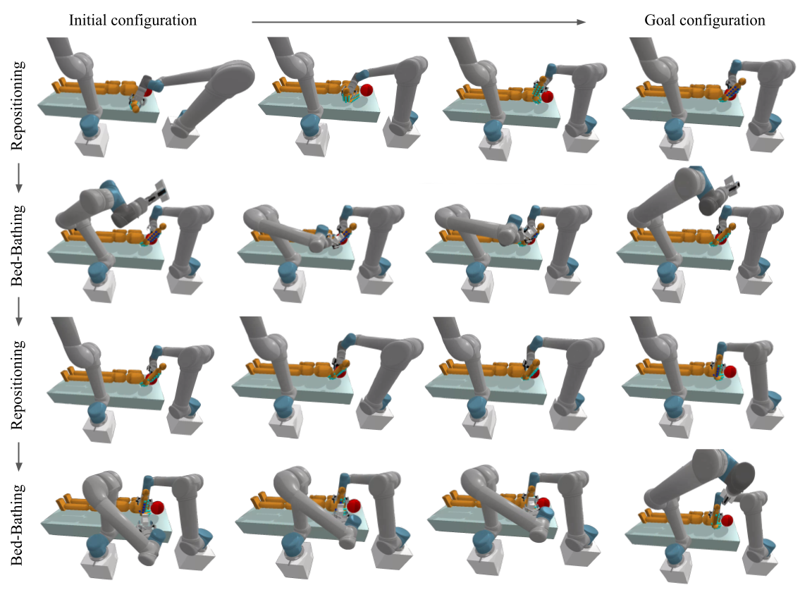

# Assistive Limb Manipulation
Official implementation of Benchmark for Robotic Manipulation of Human Limbs for Solving Assistive Care Tasks.


## How to set up the environment

* clone the repository
```
git clone https://github.com/yubink2/AssistiveManipulation.git
```

* build the docker image
```
docker build -t assistive-manip-env .
```

* run the docker container
```
xhost +local:root
docker run -it \
    --gpus all \
    -e NVIDIA_DRIVER_CAPABILITIES=all \
    -e DISPLAY \
    -e QT_X11_NO_MITSHM=1 \
    -v /tmp/.X11-unix:/tmp/.X11-unix:rw \
    assistive-manip-env /bin/bash
```

* inside the container, install pytorch3d
```
FORCE_CUDA=1 pip install 'git+https://github.com/facebookresearch/pytorch3d.git'
```

* download the pretrained model from [here](https://drive.google.com/file/d/1H9BplI2wxfPWHnoLNLXC4wGtMm4oKOoI/view?usp=sharing) and extract it in `models/`.

## How to run the limb manipulation pipeline
You can run the simulation with our pre-selected the grasp and initial configurations by running:
```
python manipulation_demo.py
```

```
python manipulation_seated_demo.py
```

Optionally, you can visualize the simulation run with the `--gui` flag. You can run our experiments with reduced ranges of shoulder joints with the `--group` flag. If you would like to generate a new grasp, you can run with the `--grasp` flag, then replace the corresponding variables in the file: `best_q_R_grasp`, `best_world_to_grasp`, and `best_world_to_eef_goal`.

## How to run the integrated bed bathing and limb manipulation pipeline

```
python wiping_manipulation_demo.py
```

You can view the full list of arguments with:
```
python wiping_manipulation_demo.py --help
```

## Acknowledgements

* We want to thank the authors of [DeepMimic](https://github.com/bulletphysics/bullet3/tree/master/examples/pybullet/gym/pybullet_envs/deep_mimic/mocap) and [RAMP](https://github.com/SamsungLabs/RAMP) for their amazing work. 