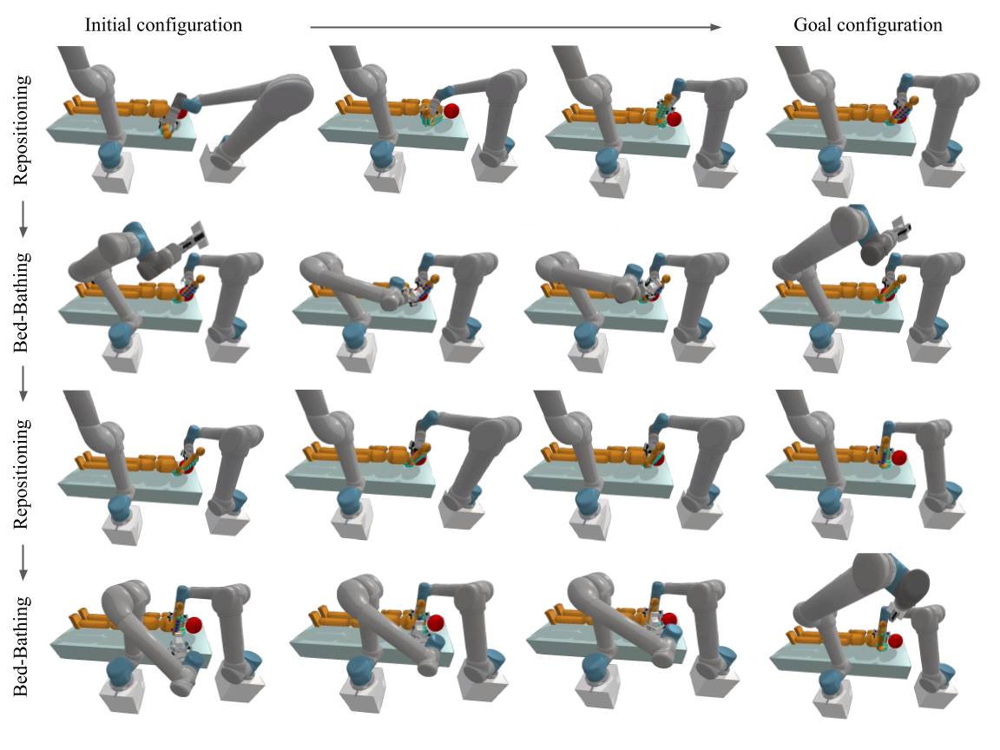

# Manip4Care
Official implementation of Manip4Care: Robotic Manipulation of Human Limbs for Solving Assistive Tasks.

[**Paper**](https://arxiv.org/abs/2508.02649) | [**Demo Video**](https://youtu.be/M1puk_67D7c)



## How to set up the environment
### Installation using conda
* create a conda environment with Python 3.8 (recommended, since other versions have not been tested)
```bash
git clone https://github.com/yubink2/Manip4Care.git
cd Manip4Care
conda create -n manip4care python=3.8
conda activate manip4care
```

* install repo + dependencies
```bash
pip install -r requirements.txt
pip install -e . --no-build-isolation
pip install -e manip4care/resources/csdf
```

* install PyTorch3D with GPU support
```bash
pip install git+https://github.com/facebookresearch/pytorch3d.git@stable
```

### Installation using Docker
* build the image
```bash
docker build -t assistive-manip-env .
```

* run the container
```bash
xhost +local:root
docker run -it \
    --gpus all \
    -e NVIDIA_DRIVER_CAPABILITIES=all \
    -e DISPLAY \
    -e QT_X11_NO_MITSHM=1 \
    -v /tmp/.X11-unix:/tmp/.X11-unix:rw \
    assistive-manip-env /bin/bash
```

* inside the container, install pytorch3d
```bash
FORCE_CUDA=1 pip install 'git+https://github.com/facebookresearch/pytorch3d.git'
```

* download the pretrained model from [here](https://drive.google.com/file/d/1H9BplI2wxfPWHnoLNLXC4wGtMm4oKOoI/view?usp=sharing) and extract it in `models/`.

## How to run the limb manipulation pipeline
You can run the simulation with our pre-selected grasp and initial configurations by running:
```bash
# human in supine position environment
python examples/manipulation_demo.py

# human in sitting position environment
python examples/manipulation_seated_demo.py
```

Optionally, you can visualize the simulation run with the `--gui` flag. You can run our experiments with reduced ranges of shoulder joints with the `--group` flag. 

## How to generate new grasp configurations
To generate a new grasp, use:
```bash
# human in supine position environment
python examples/grasp_generation_demo.py

# human in sitting position environment
python examples/grasp_generation_demo.py --seated
```

This will output new grasp parameters.
Update the following variables in the manipulation demo files with your generated values: `best_q_R_grasp`, `best_world_to_grasp`, and `best_world_to_eef_goal`.

## How to run the integrated bed bathing and limb manipulation pipeline
We provide an integrated demo of wiping and limb manipulation with the human in a supine position.

You can run the simulation with our pre-selected grasp and next goal predictor model by running:
```
python examples/wiping_manipulation_demo.py --use-predictor
```

You can run it with next goal random generator by running:
```
python examples/wiping_manipulation_demo.py --no-use-predictor
```

You can view the full list of arguments with:
```
python examples/wiping_manipulation_demo.py --help
```

## Acknowledgements

We want to thank the authors of [RAMP](https://research.samsung.com/blog/RAMP-Hierarchical-Reactive-Motion-Planning-for-Manipulation-Tasks-Using-Implicit-Signed-Distance-Functions) for their amazing work. Our trajectory planning and following for limb manipulation are adapted from their framework. Also, our wiping implementation was inspired from [AssistiveGym](https://github.com/Healthcare-Robotics/assistive-gym).